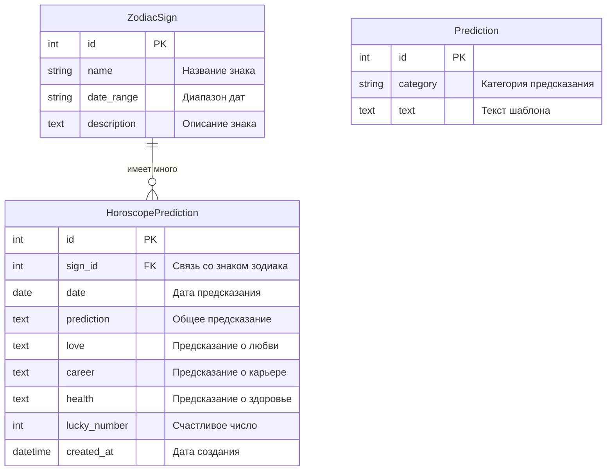

# 🔮 Астро-Гороскоп: Приложение для генерации ежедневных гороскопов


Веб-приложение на Django для генерации, хранения и отображения ежедневных гороскопов для всех знаков зодиака с использованием искусственного интеллекта GigaChat от Сбера.

## ✨ Возможности

- 🌠 Автоматическая генерация персонализированных гороскопов для всех знаков зодиака
- 🧠 Использование GigaChat API для создания уникальных предсказаний
- 📅 Ежедневное обновление прогнозов (автоматически в 00:01)
- 📱 Адаптивный дизайн для мобильных и десктопных устройств
- 🔐 Панель администратора для управления контентом
- 📊 Разделение гороскопов по категориям: общий, любовь, карьера, здоровье
- 🔢 Генерация счастливых чисел для каждого знака
- 🌐 Интеграция с расписанием задач через crontab

## 🛠 Технологический стек

### Бэкенд
- **Python 3.10+**: Основной язык программирования
- **Django 4.2.7**: Веб-фреймворк
- **PostgreSQL**: База данных для хранения гороскопов и настроек
- **Gunicorn**: WSGI-сервер для запуска Django-приложения
- **GigaChat API**: API для генерации текстов с помощью ИИ

### Фронтенд
- **HTML5/CSS3**: Разметка и стили
- **Bootstrap 5**: Фреймворк для создания адаптивного интерфейса
- **JavaScript**: Интерактивные элементы и анимации

### Инфраструктура
- **Docker**: Контейнеризация приложения
- **Docker Compose**: Оркестрация контейнеров
- **Django-crontab**: Планировщик задач для периодического обновления гороскопов

## 📋 Требования

Для запуска проекта вам потребуется:

- **Docker** и **Docker Compose** (рекомендуется)
  
  или

- **Python 3.10+**
- **PostgreSQL 14+**
- **pip** (менеджер пакетов Python)
- **Учетная запись GigaChat API** для получения API-ключа

## 🚀 Установка и запуск

### 🐳 Запуск с помощью Docker (простой способ)

#### Шаг 1: Установка необходимых программ

1. **Установите Docker Desktop**:
   - Перейдите на официальный сайт: https://www.docker.com/products/docker-desktop
   - Нажмите большую синюю кнопку "Download Docker Desktop"
   - После загрузки запустите установщик (файл с расширением .exe)
   - Следуйте инструкциям установщика, нажимая "Next" (Далее)
   - В конце установки нажмите "Finish" (Готово)
   - Перезагрузите компьютер

2. **Проверьте установку**:
   - Нажмите Win + R
   - Введите cmd и нажмите Enter
   - В открывшемся окне введите:
     ```bash
     docker --version
     ```
   - Если видите что-то вроде "Docker version 20.10.x", значит всё установлено правильно

#### Шаг 2: Скачивание проекта

1. **Скачайте ZIP-архив проекта**:
   - Перейдите по ссылке: https://github.com/k3ksoff/astro-horoscope
   - Нажмите зеленую кнопку "Code"
   - Выберите "Download ZIP"
   - Сохраните файл на рабочий стол

2. **Распакуйте архив**:
   - Найдите скачанный ZIP-файл на рабочем столе
   - Правой кнопкой мыши → "Извлечь все..."
   - Выберите папку (например, "C:\Projects\astro-horoscope")
   - Нажмите "Извлечь"

#### Шаг 3: Настройка проекта

1. **Создайте файл с настройками**:
   - Откройте папку проекта
   - Правой кнопкой мыши → "Создать" → "Текстовый документ"
   - Назовите его точно так: `.env` (с точкой в начале!)
   - Если Windows спрашивает про смену расширения, нажмите "Да"

2. **Заполните настройки**:
   - Откройте созданный файл .env в Блокноте
   - Скопируйте и вставьте следующий текст:
     ```ini
     DEBUG=False
     SECRET_KEY=your-secret-key-123
     DJANGO_ALLOWED_HOSTS=localhost 127.0.0.1 [::1]
     
     # Настройки базы данных (не меняйте!)
     DATABASE_NAME=horoscope_db
     DATABASE_USER=postgres
     DATABASE_PASSWORD=postgres
     DATABASE_HOST=db
     DATABASE_PORT=5432
     
     # Ваш ключ GigaChat (получите его на https://developers.sber.ru/)
     GIGACHAT_API_KEY=ваш-ключ-gigachat
     
     # Настройки администратора (можете изменить)
     DJANGO_SUPERUSER_USERNAME=admin
     DJANGO_SUPERUSER_EMAIL=admin@example.com
     DJANGO_SUPERUSER_PASSWORD=adminpassword
     ```
   - Замените `ваш-ключ-gigachat` на настоящий ключ от GigaChat
   - Сохраните файл (Ctrl + S)

#### Шаг 4: Запуск приложения

1. **Откройте командную строку в папке проекта**:
   - Откройте папку с проектом
   - В адресной строке проводника (сверху) нажмите левой кнопкой мыши
   - Введите `cmd` и нажмите Enter

2. **Запустите Docker-контейнеры**:
   ```bash
   docker-compose up
   ```
   - Первый запуск может занять 5-10 минут
   - Дождитесь сообщения "Starting development server at http://0.0.0.0:8000/"
   - Не закрывайте это окно, пока работаете с приложением!

#### Шаг 5: Проверка работы

1. **Откройте приложение**:
   - Запустите любой браузер (Chrome, Firefox, Edge)
   - Введите в адресной строке: http://localhost:8000
   - Должна открыться главная страница приложения

2. **Войдите в панель администратора**:
   - Перейдите по адресу: http://localhost:8000/admin
   - Введите логин: admin
   - Введите пароль: adminpassword (или тот, который вы указали в файле .env)

#### Шаг 6: Завершение работы

1. **Остановка приложения**:
   - Вернитесь в окно командной строки
   - Нажмите Ctrl + C
   - Дождитесь остановки всех контейнеров
   - Введите команду:
     ```bash
     docker-compose down
     ```

#### Частые проблемы и их решение

1. **Ошибка "port is already in use"**:
   - Откройте командную строку (Win + R → cmd)
   - Введите:
     ```bash
     netstat -ano | findstr :8000
     ```
   - Запомните номер (PID) справа
   - Введите:
     ```bash
     taskkill /PID номер_который_запомнили /F
     ```
   - Попробуйте запустить приложение снова

2. **Docker не запускается**:
   - Проверьте, запущен ли Docker Desktop
   - Найдите значок Docker в трее (внизу справа)
   - Если его нет, запустите Docker Desktop из меню Пуск

3. **Не создаётся файл .env**:
   - Создайте обычный текстовый файл
   - Сохраните его как "env.txt"
   - Переименуйте в ".env"
   - Или используйте команду в командной строке:
     ```bash
     rename env.txt .env
     ```

#### Полезные команды

```bash
# Просмотр запущенных контейнеров
docker-compose ps

# Просмотр логов
docker-compose logs

# Перезапуск контейнеров
docker-compose restart

# Полная остановка и удаление контейнеров
docker-compose down

# Запуск в фоновом режиме
docker-compose up -d
```

### Запуск вручную

Если вы предпочитаете запускать приложение без Docker:

1. **Установите Python 3.10+** (если не установлен)

2. **Клонируйте репозиторий**:
   ```bash
   git clone https://github.com/k3ksoff/astro-horoscope.git
   cd astro-horoscope
   ```

3. **Создайте и активируйте виртуальное окружение**:
   ```bash
   python -m venv venv
   
   # В Windows:
   venv\Scripts\activate
   
   # В Linux/Mac:
   source venv/bin/activate
   ```

4. **Установите зависимости**:
   ```bash
   pip install -r requirements.txt
   ```

5. **Создайте файл .env** аналогично шагу 2 в разделе запуска с Docker, но укажите правильные настройки для вашей локальной базы данных PostgreSQL.

6. **Создайте и примените миграции**:
   ```bash
   python manage.py makemigrations horoscope
   python manage.py migrate
   ```

7. **Создайте суперпользователя**:
   ```bash
   python manage.py createsuperuser
   ```

8. **Запустите сервер разработки**:
   ```bash
   python manage.py runserver
   ```

9. **Проверьте работу приложения**:
   Откройте браузер и перейдите по адресу: http://127.0.0.1:8000

## ⚙️ Настройка переменных окружения

Для правильной работы приложения необходимо настроить следующие переменные окружения в файле `.env`:

| Переменная | Описание | Пример значения |
|------------|----------|-----------------|
| DEBUG | Режим отладки Django | False |
| SECRET_KEY | Секретный ключ Django | your-secure-secret-key |
| DJANGO_ALLOWED_HOSTS | Разрешенные хосты | localhost 127.0.0.1 [::1] |
| DATABASE_NAME | Имя базы данных | horoscope_db |
| DATABASE_USER | Пользователь базы данных | postgres |
| DATABASE_PASSWORD | Пароль пользователя базы данных | postgres |
| DATABASE_HOST | Хост базы данных | db |
| DATABASE_PORT | Порт базы данных | 5432 |
| GIGACHAT_API_KEY | API-ключ для доступа к GigaChat API | your-api-key |
| DJANGO_SUPERUSER_USERNAME | Имя суперпользователя | admin |
| DJANGO_SUPERUSER_EMAIL | Email суперпользователя | admin@example.com |
| DJANGO_SUPERUSER_PASSWORD | Пароль суперпользователя | adminpassword |

## 🎮 Использование приложения

После запуска приложения вы можете:

1. **Просматривать гороскопы**:
   - Откройте главную страницу и выберите свой знак зодиака
   - Просмотрите прогноз на текущий день с разбивкой по категориям

2. **Генерировать новые гороскопы через панель администратора**:
   - Войдите в админ-панель по адресу /admin
   - Перейдите в раздел "Предсказания"
   - Используйте функцию "Сгенерировать с GigaChat"

## 👨‍💼 Администрирование

Для управления приложением используйте Django Admin Panel:

1. **Вход в панель администратора**:
   - Перейдите по адресу: http://localhost:8000/admin 
   - Введите имя пользователя и пароль (по умолчанию admin/adminpassword)

2. **Управление знаками зодиака**:
   - Добавление, редактирование и удаление знаков зодиака
   - Изменение описаний и дат знаков

3. **Управление предсказаниями**:
   - Просмотр всех сгенерированных гороскопов
   - Редактирование существующих предсказаний
   - Генерация новых предсказаний с помощью GigaChat

4. **Управление шаблонами предсказаний**:
   - Добавление новых шаблонов для использования в случае недоступности GigaChat API

## 🧠 Генерация гороскопов с помощью GigaChat

Приложение интегрировано с GigaChat API от Сбера для генерации уникальных и интересных гороскопов.

### Получение API-ключа

1. Зарегистрируйтесь на [платформе разработчиков Сбера](https://developers.sber.ru/)
2. Создайте проект и активируйте GigaChat API
3. Получите API-ключ и добавьте его в переменные окружения

### Способы генерации гороскопов

#### 1. Через админ-панель:
- Перейдите в раздел "Предсказания"
- Нажмите на кнопку "Сгенерировать с GigaChat"
- Выберите знак зодиака и подтвердите

#### 2. Через командную строку:
- Для всех знаков:
  ```bash
  python manage.py generate_horoscopes
  ```
- Для конкретного знака:
  ```bash
  python manage.py generate_horoscopes --sign Овен
  ```

#### 3. Автоматическое обновление:
- Гороскопы обновляются ежедневно в 00:01 с помощью crontab

## ⏰ Периодические задачи

### Настройка crontab

Приложение использует django-crontab для автоматической генерации гороскопов. При запуске в Docker, crontab настраивается автоматически.

Для ручной настройки:

```bash
# Добавление задач в crontab
python manage.py crontab add

# Просмотр текущих задач
python manage.py crontab show

# Удаление задач
python manage.py crontab remove
```

## 📁 Структура проекта

Основные компоненты проекта:

```
horoscope_project/         # Корневая папка проекта Django
├── horoscope/             # Основное приложение
│   ├── migrations/        # Миграции базы данных
│   ├── management/        # Команды управления Django
│   │   └── commands/      # Пользовательские команды
│   ├── templates/         # HTML шаблоны
│   ├── admin.py           # Настройки админ-панели
│   ├── gigachat_client.py # Клиент для работы с GigaChat API
│   ├── models.py          # Модели данных
│   ├── services.py        # Бизнес-логика
│   ├── tasks.py           # Задачи для crontab
│   ├── urls.py            # URL маршруты
│   └── views.py           # Обработчики запросов
├── static/                # Статические файлы (CSS, JS, изображения)
├── templates/             # Общие шаблоны проекта
├── scripts/               # Скрипты для Docker
├── .env                   # Переменные окружения
├── docker-compose.yml     # Конфигурация Docker Compose
├── Dockerfile             # Инструкции для сборки Docker-образа
└── requirements.txt       # Python-зависимости
```

## ❓ Часто задаваемые вопросы

### 1. Как изменить время автоматической генерации гороскопов?

Отредактируйте файл `settings.py` и измените настройку CRONJOBS:

```python
CRONJOBS = [
    # Формат: '<минута> <час> <день_месяца> <месяц> <день_недели> <команда>'
    ('1 0 * * *', 'horoscope.tasks.generate_daily_horoscopes', '>> /tmp/horoscope_generation.log 2>&1')
]
```

Например, для запуска в 8:30 утра каждый день:
```python
('30 8 * * *', 'horoscope.tasks.generate_daily_horoscopes', '>> /tmp/horoscope_generation.log 2>&1')
```

После изменения перезапустите crontab:
```bash
python manage.py crontab remove
python manage.py crontab add
```

### 2. Что делать, если GigaChat API недоступен?

Приложение автоматически переключится на использование шаблонных предсказаний из базы данных. Вы можете добавить свои шаблоны через админ-панель в разделе "Шаблоны предсказаний".


## 🔧 Устранение неполадок

### Проблема: Ошибка "ModuleNotFoundError: No module named 'django_crontab'"

**Решение**: Установите django-crontab:
```bash
pip install django-crontab
```

Если вы используете Docker, проверьте файл entrypoint.sh и убедитесь, что он включает установку django-crontab.

### Проблема: GigaChat API возвращает ошибку аутентификации

**Решение**: 
1. Проверьте правильность API-ключа в настройках .env
2. Убедитесь, что у вас активирован доступ к GigaChat API в личном кабинете
3. Проверьте, не истек ли срок действия ключа

### Проблема: Сервер не запускается

**Решение**:
1. Проверьте логи Docker:
```bash
docker-compose logs web
```
2. Проверьте, запущена ли база данных:
```bash
docker-compose ps
```
3. Убедитесь, что переменные окружения указаны правильно


## 🗄️ База данных и структура данных

### 📊 ER-диаграмма базы данных



### 📝 Описание сущностей

#### 1. **ZodiacSign (Знак зодиака)**

Содержит основную информацию о знаках зодиака.

| Поле | Тип | Описание | Пример |
|------|-----|----------|--------|
| id | Integer | Первичный ключ | 1 |
| name | CharField (50) | Название знака | "Овен" |
| date_range | CharField (100) | Период действия знака | "21 марта - 19 апреля" |
| description | TextField | Описание знака зодиака | "Овен - первый знак зодиака, символизирующий энергию и инициативу..." |

#### 2. **HoroscopePrediction (Предсказание гороскопа)**

Хранит предсказания для каждого знака зодиака на определенную дату.

| Поле | Тип | Описание | Пример |
|------|-----|----------|--------|
| id | Integer | Первичный ключ | 1 |
| sign_id | Integer (FK) | Внешний ключ к таблице ZodiacSign | 1 (Овен) |
| date | Date | Дата предсказания | "2024-03-21" |
| prediction | TextField | Общее предсказание на день | "Сегодня благоприятный день для новых начинаний..." |
| love | TextField | Предсказание в сфере любви | "В личной жизни возможны приятные сюрпризы..." |
| career | TextField | Предсказание в сфере карьеры | "На работе вы можете столкнуться с новыми задачами..." |
| health | TextField | Предсказание о здоровье | "Обратите внимание на свой режим питания..." |
| lucky_number | Integer | Счастливое число дня | 7 |
| created_at | DateTime | Дата и время создания записи | "2024-03-20 23:01:15" |

#### 3. **Prediction (Шаблон предсказания)**

Содержит шаблоны для генерации предсказаний при недоступности GigaChat API.

| Поле | Тип | Описание | Пример |
|------|-----|----------|--------|
| id | Integer | Первичный ключ | 1 |
| category | CharField (50) | Категория предсказания | "love" |
| text | TextField | Текст шаблона предсказания | "Ваша личная жизнь сегодня будет наполнена яркими эмоциями..." |

### 🔄 Связи между таблицами

1. **ZodiacSign → HoroscopePrediction**:
   - Тип связи: "Один ко многим" (One-to-Many)
   - Каждый знак зодиака может иметь множество предсказаний (по одному на каждый день)
   - Реализуется через внешний ключ `sign_id` в таблице `HoroscopePrediction`
   - Ограничение: `ON DELETE CASCADE` - при удалении знака зодиака удаляются все его предсказания
